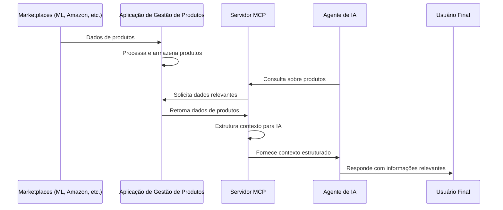

# Definição do Projeto Casa Digital MCP

## Visão Geral
### O Casa Digital MCP é um sistema composto por duas aplicações integradas:
1. **Aplicação de Gestão de Produtos**: Responsável por sincronizar, armazenar e gerenciar produtos das lojas afiliadas
2. **Servidor MCP**: Responsável por fornecer contexto estruturado sobre esses produtos para agentes de IA

## Objetivos
- Fornecer um servidor MCP específico para responder a agentes de IA sobre produtos de e-commerce
- Facilitar a inclusão ou alteração da lista de lojas de afiliação
- Otimizar a recuperação e estruturação de informações para consumo por agentes de IA

## Arquitetura

### 1. Arquitetura de Duas Aplicações Integradas

#### 1.1. Aplicação de Gestão de Produtos

Esta aplicação seria focada em:

#### Sincronizar produtos de diferentes marketplaces (Mercado Livre, Amazon, etc.)
#### Gerenciar o banco de dados de produtos
#### Gerar e gerenciar links de afiliados
#### Fornecer uma interface administrativa para gerenciar lojas afiliadas


```
product_management_service/
├── app/
│   ├── api/
│   │   ├── endpoints/
│   │   │   ├── products.py          # CRUD de produtos
│   │   │   ├── sync.py              # Sincronização com marketplaces
│   │   │   ├── affiliate_links.py   # Gestão de links de afiliados
│   │   │   └── affiliate_stores.py  # Gestão de lojas afiliadas
│   ├── models/
│   │   ├── product.py               # Modelo de produto
│   │   └── affiliate_store.py       # Modelo de loja afiliada
│   ├── schemas/
│   │   ├── product.py               # Schemas de produto
│   │   └── affiliate_store.py       # Schemas de loja afiliada
│   ├── services/
│   │   ├── affiliate_service.py     # Serviço de afiliados
│   │   └── sync_service.py          # Serviço de sincronização
│   └── clients/                     # Clientes para APIs externas
│       ├── mercadolivre_client.py
│       ├── amazon_client.py
│       └── base_client.py           # Cliente base para facilitar extensão
└── ...
```

### 1.2. Servidor MCP para E-commerce
Esta aplicação seria focada em:

#### Fornecer contexto estruturado sobre produtos para agentes de IA
#### Processar consultas em linguagem natural sobre produtos
#### Gerenciar metadados e embeddings para busca semântica
#### Otimizar a recuperação de informações para baixa latência


```
mcp_ecommerce_server/
├── app/
│   ├── api/
│   │   ├── endpoints/
│   │   │   ├── context.py           # Endpoints para fornecer contexto
│   │   │   ├── query.py             # Endpoints para consultas em linguagem natural
│   │   │   └── metadata.py          # Endpoints para gerenciar metadados
│   ├── models/
│   │   ├── context.py               # Modelo para contextos
│   │   ├── query.py                 # Modelo para consultas
│   │   └── embedding.py             # Modelo para embeddings
│   ├── schemas/
│   │   ├── context.py               # Schemas para contextos
│   │   ├── query.py                 # Schemas para consultas
│   │   └── response.py              # Schemas para respostas
│   ├── services/
│   │   ├── context_service.py       # Serviço para gerenciamento de contexto
│   │   ├── query_service.py         # Serviço para processamento de consultas
│   │   ├── embedding_service.py     # Serviço para embeddings e busca semântica
│   │   └── product_service.py       # Serviço para integração com a aplicação de produtos
│   └── integrations/
│       └── product_api_client.py    # Cliente para a API de produtos
└── ...
```

## Componentes Principais

Modelo de Contexto:

```python
class Context(Base):
    __tablename__ = "contexts"
    
    id = Column(Integer, primary_key=True, index=True)
    query = Column(String, index=True)
    response = Column(JSON)
    embedding = Column(Vector(1536))  # Usando pgvector para armazenar embeddings
    created_at = Column(DateTime(timezone=True), server_default=func.now())
```

Serviço de Contexto:

```python
class ContextService:
    def __init__(self, db, product_client):
        self.db = db
        self.product_client = product_client
        self.embedding_service = EmbeddingService()
    
    async def get_context_for_query(self, query: str):
        # Gerar embedding para a consulta
        query_embedding = await self.embedding_service.generate_embedding(query)
        
        # Verificar se existe um contexto similar
        similar_context = self.db.query(Context).order_by(
            Context.embedding.cosine_distance(query_embedding)
        ).first()
        
        if similar_context and similar_context.embedding.cosine_distance(query_embedding) < 0.1:
            return similar_context.response
        
        # Buscar produtos relevantes para a consulta
        products = await self.product_client.search_products(query)
        
        # Estruturar contexto com base nos produtos
        context = self._structure_context(query, products)
        
        # Salvar contexto para futuras consultas
        db_context = Context(
            query=query,
            response=context,
            embedding=query_embedding
        )
        self.db.add(db_context)
        self.db.commit()
        
        return context
    
    def _structure_context(self, query, products):
        # Estruturar contexto com base na consulta e produtos
        # Isso pode incluir categorização, agrupamento por relevância, etc.
        pass
```

Cliente para API de Produtos:

```python
class ProductApiClient:
    def __init__(self, base_url):
        self.base_url = base_url
    
    async def search_products(self, query, **kwargs):
        url = f"{self.base_url}/api/v1/products/search"
        params = {"query": query, **kwargs}
        async with httpx.AsyncClient() as client:
            response = await client.get(url, params=params)
            if response.status_code == 200:
                return response.json()
            else:
                raise Exception(f"Error searching products: {response.text}")
    
    async def get_product(self, product_id):
        url = f"{self.base_url}/api/v1/products/{product_id}"
        async with httpx.AsyncClient() as client:
            response = await client.get(url)
            if response.status_code == 200:
                return response.json()
            else:
                raise Exception(f"Error getting product: {response.text}")
```

Endpoint para Consultas:

```python
@router.post("/query/", response_model=QueryResponse)
async def process_query(
    query: QueryRequest,
    context_service: ContextService = Depends(get_context_service),
    db: Session = Depends(get_db)
):
    context = await context_service.get_context_for_query(query.text)
    return {
        "query": query.text,
        "context": context,
        "timestamp": datetime.now()
    }
```

## Integração com Agentes de IA
O servidor MCP forneceria uma API que os agentes de IA poderiam consultar para obter contexto estruturado sobre produtos:

```python
# Exemplo de como um agente de IA poderia usar o servidor MCP
async def get_product_context(query):
    url = "http://mcp-server.example.com/api/v1/query/"
    payload = {"text": query}
    async with httpx.AsyncClient() as client:
        response = await client.post(url, json=payload)
        if response.status_code == 200:
            return response.json()["context"]
        else:
            raise Exception(f"Error getting context: {response.text}")

# Uso no agente de IA
async def answer_product_question(user_question):
    context = await get_product_context(user_question)
    # O agente usa o contexto para formular uma resposta informada
    # ...
```


## Fluxo de Dados



## Plano de Implementação
4. Implementação da Aplicação de Gestão de Produtos
A aplicação atual (casa_digital_mcp) já parece bem estruturada para esta função, com algumas melhorias sugeridas:

4.1. Melhorias na Estrutura Atual
Modelo de Loja Afiliada:

```python
class AffiliateStore(Base):
    __tablename__ = "affiliate_stores"
    
    id = Column(Integer, primary_key=True, index=True)
    name = Column(String, index=True)
    platform = Column(String, index=True)  # mercadolivre, amazon, etc.
    api_credentials = Column(JSON)  # Armazena credenciais de forma segura
    active = Column(Boolean, default=True)
    created_at = Column(DateTime(timezone=True), server_default=func.now())
    updated_at = Column(DateTime(timezone=True), onupdate=func.now())
```

Cliente Base para Extensibilidade:

```python
class BaseMarketplaceClient:
    def __init__(self, credentials=None):
        self.credentials = credentials
    
    async def search_products(self, query, category=None, limit=50):
        raise NotImplementedError("Subclasses must implement this method")
    
    async def generate_affiliate_link(self, product_url):
        raise NotImplementedError("Subclasses must implement this method")
```

Serviço de Afiliados Melhorado:

```python
class AffiliateService:
    def __init__(self, db):
        self.db = db
        self.clients = {}
        self._load_clients()
    
    def _load_clients(self):
        # Carrega clientes dinamicamente com base nas lojas afiliadas ativas
        stores = self.db.query(AffiliateStore).filter(AffiliateStore.active == True).all()
        for store in stores:
            if store.platform == "mercadolivre":
                self.clients[store.id] = MercadoLivreClient(store.api_credentials)
            elif store.platform == "amazon":
                self.clients[store.id] = AmazonClient(store.api_credentials)
            # Adicionar mais plataformas conforme necessário
    
    def get_client(self, store_id):
        if store_id not in self.clients:
            raise ValueError(f"Store with ID {store_id} not found or not active")
        return self.clients[store_id]
    
    async def search_products(self, store_id, query, **kwargs):
        client = self.get_client(store_id)
        return await client.search_products(query, **kwargs)
```


Endpoint para Gerenciar Lojas Afiliadas:

```python
@router.post("/affiliate-stores/", response_model=AffiliateStoreInDB)
def create_affiliate_store(
    store: AffiliateStoreCreate,
    db: Session = Depends(get_db)
):
    db_store = AffiliateStore(**store.model_dump())
    db.add(db_store)
    db.commit()
    db.refresh(db_store)
    return db_store
```


## Considerações Técnicas
### Benefícios desta Arquitetura
Separação de Responsabilidades:

#### 
* A aplicação de gestão de produtos foca na sincronização e armazenamento. 
* O servidor MCP foca na estruturação e fornecimento de contexto para IA Facilidade para Adicionar Novas Lojas Afiliadas:

##### 
* A arquitetura modular da aplicação de gestão de produtos facilita a adição de novos clientes. 
* O padrão de cliente base (base_client.py) permite extensão fácil para novos marketplaces
* Otimização para Diferentes Casos de Uso:

###### 
* A aplicação de gestão de produtos pode ser otimizada para operações de sincronização em massa
* O servidor MCP pode ser otimizado para baixa latência e processamento de linguagem natural
* Escalabilidade Independente:

#####
* Cada aplicação pode escalar de acordo com suas necessidades específicas
* A sincronização de produtos pode ser intensiva em recursos, enquanto o servidor MCP precisa ser responsivo

## Referências
[Links para documentos relacionados, APIs externas, etc.]